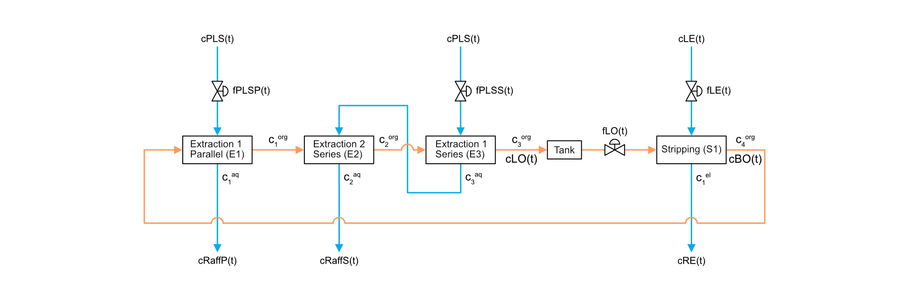

# Process State Identification

BEng ChemE final year project using PCA and statistical classification to identify a process' state.

## Usage instructions

1. Run the Simulink model from the MATLAB Live Script `process_model/copper_solvent_extraction_model.mlx`.

1. Run the MATLAB Live Script from the main `Process-State-Identification` folder.

## Simulation settings

| Setting               | Values                    | Description                                                                 |
|-----------------------|---------------------------|-----------------------------------------------------------------------------|
| `SAVE_IMAGES`         | - `true`   - `false`   | Saves the generated images to the respective output folder if set to `true` |
| `SAVE_DATA`           | - `true`   - `false`   | Saves the simulation data to the respective output folder if set to `true`  |
| `SENSOR_NOISE`        | - `true`   - `false`   | Adds sensor noise to the measurements if set to `true`                      |
| `FEEDBACK_CONTROL`    | - `true`   - `false`   | Enables feedback control of the process if set to `true`                    |
| `FEEDFORWARD_CONTROL` | - `true`   - `false`   | Enables feedforward control of the process if set to `true`                 |
