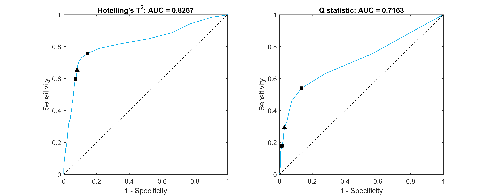
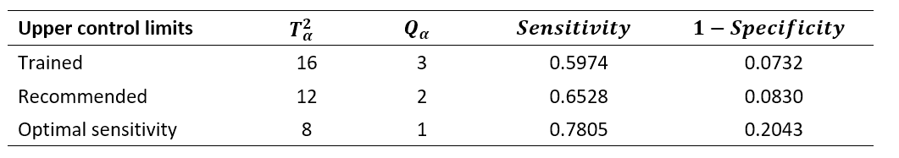

# Process State Identification

   

Chemical Engineering final-year project simulating a copper solvent extraction process with valve faults using PCA and statistical classification to identify when the process enters a fault state.

The process model consists of a dynamic model of a copper solvent extraction plant based on the model developed by Komulainen et al. (2009, 2006). 
The model simulates two control valve faults, namely:

- stuck valves
- and valve stiction, based on the physical valve stiction model developed by Shoukat Choudhury et al. (2005)

## Resources

- [Intructions.md](instructions.md) contains instructions for running the process model, fitting the ARX models, tuning the feedback and feedforward controllers, simulating the process states, performing the statistical process control, detecting the simulated control valve faults, and quantifying the performance of the fault detection classifiers.

- The [results](results) folder contains the simulation and fault detection data in .csv format, and the generated graphs produced throughout the project are available.

## Results

Control limits that balance the specificity of the training control limits and the sensitivity of the optimal sensitivity control limits are required. The following recommended upper control limits are proposed: a T2α value of 12, and a Qα value of 2. These represent an average point between the trained upper control limits and the optimal sensitivity upper control limits. The recommended upper control limits are provided in Figure 1, and are indicated by the dark triangles. The left dark squares in Figure 1 represent the trained upper control limits, and the right dark squares in Figure 1 represent the optimal sensitivity upper control limits.

Figure 1: ROC curves for the Hotelling's T2 statistic and Q statistic control charts for the simulated process faults dataset with the left dark squares indicating the trained upper control limits, the right dark squares indicating the optimal sensitivity upper control limits, and the recommended upper control limits indicated by the dark triangles

Table 1 provides the trained, recommended, and optimal sensitivity T2α and Qα upper control limits. The associated combined fault detection’s sensitivity and 1 - specificity for the different upper control limits are also given.

Table 1: Combined fault detection’s sensitivity and 1 - specificity for the different upper control limits

It is therefore proposed that the predictive maintenance model for the developed copper solvent extraction plant uses the recommended upper control limits. These upper control limits strike a balance between a high specificity and ensuring that the highest number of control valve faults can be detected. This ensures a high rich electrolyte product quality, while at the same time not raising too many false alarms and wasting operator work hours.

## References

Komulainen, T., Doyle, F.J., Rantala, A., Jämsä-Jounela, S.L., 2009. Control of an industrial copper solvent extraction process. Journal of Process Control 19, 2–15. https://doi.org/10.1016/j.jprocont.2008.04.019

Komulainen, T., Pekkala, P., Rantala, A., Jämsä-Jounela, S.L., 2006. Dynamic modelling of an industrial copper solvent extraction process. Hydrometallurgy 81, 52–61. https://doi.org/10.1016/j.hydromet.2005.11.001

Shoukat Choudhury, M.A.A., Thornhill, N.F., Shah, S.L., 2005. Modelling Valve Stiction. Control Eng Pract 13, 641–658. https://doi.org/10.1016/j.conengprac.2004.05.005

