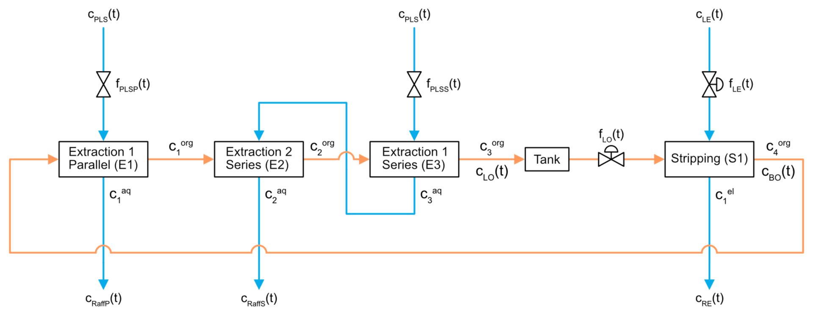

# Process State Identification


Chemical Engineering final year project using PCA and statistical classification to identify a process' state.

## Usage instructions

### Running the simulation

1. Run the Simulink model from the MATLAB Live Script `process_model/copper_solvent_extraction_model.mlx`.

1. Run the MATLAB Live Script from the main `Process-State-Identification` folder.

### Simulation settings

| Setting                           | Values                       | Description                                                                 |
|-----------------------------------|------------------------------|-----------------------------------------------------------------------------|
| `SAVE_IMAGES`                     | `true` <br> `false`          | Saves the generated images to the respective output folder if set to `true`.|
| `SAVE_DATA`                       | `true` <br> `false`          | Saves the simulation data to the respective output folder if set to `true`. |
| `SENSOR_NOISE`                    | `true` <br> `false`          | Adds sensor noise to the measurements if set to `true`.                     |
| `FEEDBACK_CONTROL`                | `true` <br> `false`          | Enables feedback control of the process if set to `true`.                   |
| `FEEDFORWARD_CONTROL`             | `true` <br> `false`          | Enables feedforward control of the process if set to `true`.                |
| `EXTERNAL_VARIABLES_STEADY_STATE` | `true` <br> `false`          | Sets the external variables to their constant steady-state values when set to `true`, or loads the non-steady-state external variable dataset selected by `EXTERNAL_VARIABLES_DATASET` when set to `false`.|
| `EXTERNAL_VARIABLES_DATASET`      | `'training'` <br> `'testing'`| Loads the training non-steady-state external variable dataset when set to `'training'`, or the testing non-steady-state external variable dataset when set to `'testing'`. Must specify a dataset to use regardless of the value of `EXTERNAL_VARIABLES_STEADY_STATE`.|
| `PROCESS_STATE`                   | see below                    | Select which process faults occur by selecting the process state. See Process States section below. |


### Output folder structure

Create the following folder structure to save to simulation results using the `SAVE_IMAGES` and `SAVE_DATA` settings:

```
.
|__ process_model
    |__ output
        |__ data
        |__ graphs
            |__ measured_variables
            |__ process_variables
```

Create the following folder structure to save the ARX model results:

```
.
|__ controller_tuning
    |__ output
        |__ feedback
        |__ feedforward
```

Create the following folder structure to save the smoothed external variable data and graphs:

```
.
|__ external_variables
    |___ output
         |__ data
         |__ graphs

```

## Process States

## References

Komulainen, T., Doyle, F.J., Rantala, A., Jämsä-Jounela, S.L., 2009. Control of an industrial copper solvent extraction process. Journal of Process Control 19, 2–15. https://doi.org/10.1016/j.jprocont.2008.04.019

Komulainen, T., Pekkala, P., Rantala, A., Jämsä-Jounela, S.L., 2006. Dynamic modelling of an industrial copper solvent extraction process. Hydrometallurgy 81, 52–61. https://doi.org/10.1016/j.hydromet.2005.11.001


